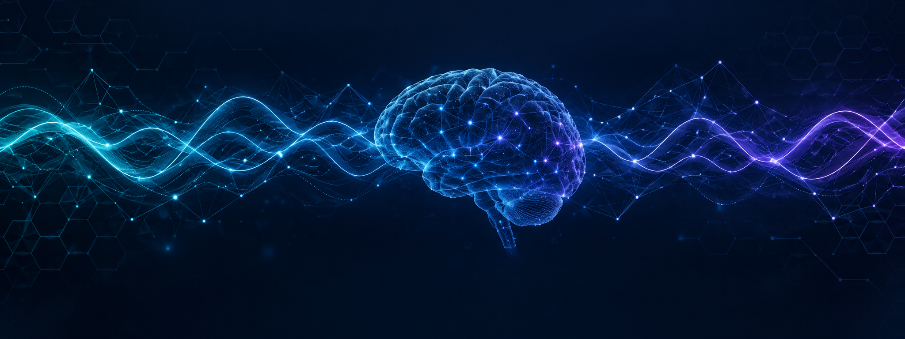
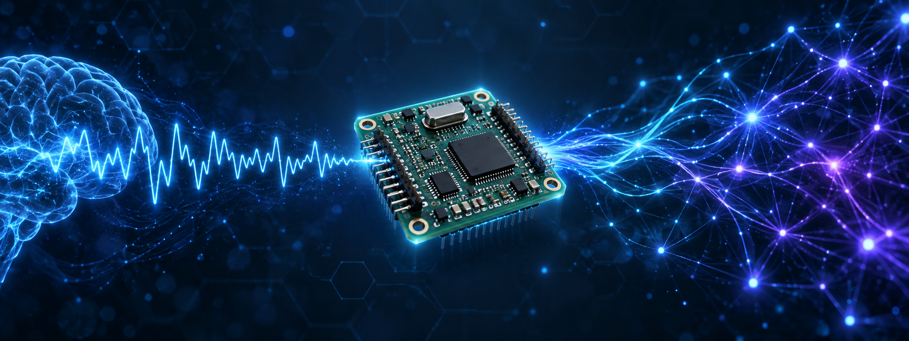
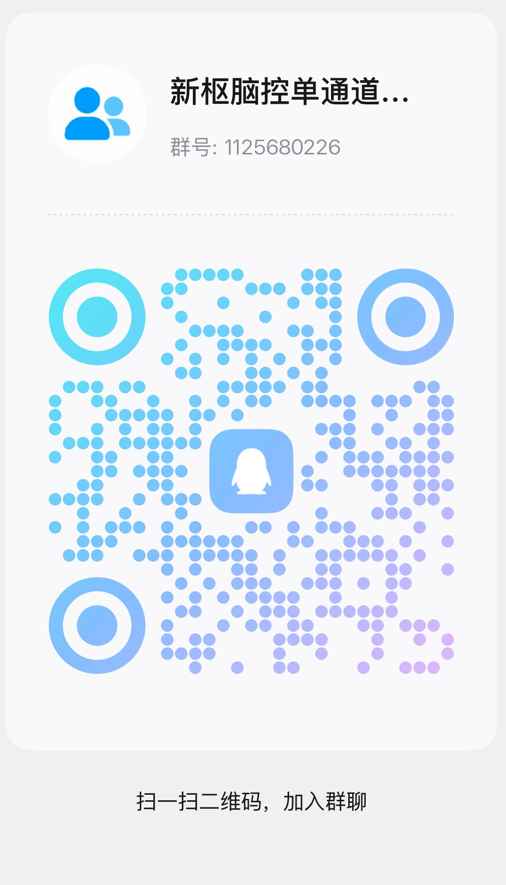
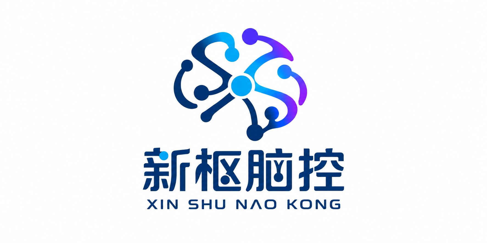

  

<h1 align="center">NeuPivot · 新枢脑控</h1>

  <b>Open-source neurotechnology, from silicon to software.</b> 
  <b>开源神经科技 —— 从芯片到软件。</b>

---

## Who We Are / 我们是谁

**English**

We are **NeuPivot (新枢脑控)**, a team building open brain-computer interface hardware. We believe neurotechnology should be hackable by anyone — so we open-source the entire stack: PCB schematics and Gerbers, firmware, signal processing, and host software.

**中文**

我们是**新枢脑控（NeuPivot）**，一支做开源脑机接口硬件的团队。我们相信神经科技应该人人可玩 —— 因此我们把全栈都开源：PCB 原理图与 Gerber、固件、信号处理与上位机软件。

Our mission: **let everyone read the language of the brain.**
我们的使命：**让每个人都能读懂大脑的语言。**

## Core Projects / 核心项目

We open-source our core EEG development platform:

我们开源旗下核心脑电开发平台：

- **[NeuEEG](https://github.com/NeuPivot/NeuEEG)**

Fully open-source single-channel EEG stack — hardware, firmware, and host software.

全栈开源单通道脑电 —— 硬件、固件与上位机。实测短接底噪 0.057 µVrms / 0.41 µVpp。

## Contact / 联系我们

- GitHub: [github.com/NeuPivot](https://github.com/NeuPivot)
- Mail: [neupivot@gmail.com](mailto:neupivot@gmail.com)
- Bilibili: [space.bilibili.com/476644796](https://space.bilibili.com/476644796)
- QQ交流群 / QQ group: **1125680226**
- Issues & discussions: [NeuEEG issues](https://github.com/NeuPivot/NeuEEG/issues)

  

  

